# Introduction to Data Visualization with Tableau
- Why do we need visualizations - Because summary statistics don't tell the full story. A lot of time datasets have the same summary statistics, but the actual data were very different!
- Read `The Visual Display of Quantitative Information` by Edward Tufte
- Anscombe's Quartet 
	Anscombe's quartet is a set of four datasets that were created by the statistician Francis Anscombe. These datasets are notable because they have nearly identical descriptive statistics, such as mean, variance, and correlation, but exhibit different patterns when visualized. Anscombe's quartet is often used to illustrate the importance of visualizing data and not relying solely on summary statistics.
	
	The four datasets in Anscombe's quartet are as follows:
	
	1. Dataset I:
	   - x: 10, 8, 13, 9, 11, 14, 6, 4, 12, 7, 5
	   - y: 8.04, 6.95, 7.58, 8.81, 8.33, 9.96, 7.24, 4.26, 10.84, 4.82, 5.68
	
	2. Dataset II:
	   - x: 10, 8, 13, 9, 11, 14, 6, 4, 12, 7, 5
	   - y: 9.14, 8.14, 8.74, 8.77, 9.26, 8.10, 6.13, 3.10, 9.13, 7.26, 4.74
	
	3. Dataset III:
	   - x: 10, 8, 13, 9, 11, 14, 6, 4, 12, 7, 5
	   - y: 7.46, 6.77, 12.74, 7.11, 7.81, 8.84, 6.08, 5.39, 8.15, 6.42, 5.73
	
	4. Dataset IV:
	   - x: 8, 8, 8, 8, 8, 8, 8, 19, 8, 8, 8
	   - y: 6.58, 5.76, 7.71, 8.84, 8.47, 7.04, 5.25, 12.50, 5.56, 7.91, 6.89
	
	Although the summary statistics of these datasets appear similar, when plotted, they reveal different patterns. Dataset I displays a relatively linear relationship, Dataset II shows a non-linear pattern, Dataset III has an outlier that influences the linear regression line, and Dataset IV is characterized by an outlier that greatly affects the correlation coefficient.
	
- Interesting books on data visualization [here](http://albertocairo.com/)
- Different data types
	1. Categorical: Categorical data represents qualitative or nominal variables that belong to specific categories or groups. The values are typically labels or names that do not have a natural numerical order. Examples of categorical data include gender (male/female), color (red/blue/green), or country of residence. Categorical data is often represented using strings or discrete numerical codes.
	
	2. Continuous: Continuous data represents quantitative variables that can take on any value within a certain range. These variables are typically measured and expressed as real numbers. Continuous data can have an infinite number of possible values and is often obtained through measurements or observations. Examples of continuous data include height, weight, temperature, or time. Continuous data is typically represented using decimal numbers.
	
	3. Discrete: Discrete data also represents quantitative variables, but it can only take on specific values within a defined set. The values are often whole numbers or counts and cannot have fractions or decimals. Discrete data usually results from counting or enumerating items. Examples of discrete data include the number of children in a family (1, 2, 3, etc.), the number of cars in a parking lot, or the number of books on a shelf.
	
	4. Ordinal: Ordinal data represents categorical variables with an inherent order or ranking among the categories. The categories have a meaningful sequence but the differences between them may not be uniform or quantifiable. Ordinal data allows for comparison in terms of greater or lesser, but the magnitude of difference may not be well-defined. Examples of ordinal data include survey responses with Likert scales (e.g., strongly agree, agree, neutral, disagree, strongly disagree) or education levels (e.g., high school, bachelor's degree, master's degree, Ph.D.).

- ## Univariate Plots
	- For quantitative data, if we are just looking at one column worth of data, we have four common visuals:
		1.  Histogram - A histogram is a graphical representation of the distribution of numerical data. It consists of a series of bars where the height of each bar represents the frequency or count of data points falling within a specific interval, known as a bin. The histogram provides insights into the underlying distribution of the data, such as whether it is symmetric, skewed, or bimodal. It is particularly useful for understanding the central tendency, spread, and shape of the data.
		2.  Normal Quantile Plot (QQ plot) - A normal quantile plot is a graphical tool used to assess whether a dataset follows a normal distribution. It compares the observed quantiles (sorted values) of the data against the expected quantiles of a theoretical normal distribution. If the data points closely follow a straight line, it indicates that the data is approximately normally distributed. Deviations from the straight line indicate departures from normality. QQ plots are helpful in identifying skewness, outliers, and other departures from normality in the data.
		   
		3.  Stem and Leaf Plot - A stem and leaf plot is a simple visual display that shows the distribution and individual values of a dataset. It provides a compact representation of the data, preserving the original values. The stem represents the leading digit(s) of each data point, and the leaf represents the trailing digit(s). The plot displays the data points in ascending order, allowing easy identification of patterns, ranges, and outliers. Stem and leaf plots are especially useful for small to moderate-sized datasets.
		   ![](data:image/jpeg;base64,/9j/4AAQSkZJRgABAQAAAQABAAD/2wCEAAoHCBIUFBgUEhQUFRgSFBoUHBkbGBkZGBgUGBgZGRsYHxsbLS0kGx0rIRgZJTclKi4xNDU0GiM6RDozPi0zNDEBCwsLEA8QHxISHzoqJCszNTYzMz4xMTM1MzMzMzM2PjMxMzMzMzM1MzQzMTYzPDMzMzMzMzQ0NTEzMzEzMzMzM//AABEIAMIBAwMBIgACEQEDEQH/xAAbAAEAAwADAQAAAAAAAAAAAAAABAUGAQIDB//EAEMQAAIBAwEEBwQHBwIFBQAAAAECAAMEERIFITFRBhMUFUGRkiIyUmE0VXFzodPhFkKBorGy0SMlJDVDcsEHF1Ni8f/EABoBAQADAQEBAAAAAAAAAAAAAAABAgMEBQb/xAAuEQACAgEDAwMCBQUBAAAAAAAAAQIRAxIhMQRBURMUoVLwBXGBseEiMmGRwRX/2gAMAwEAAhEDEQA/AN9EROUoIiIAiIgCIiAIiIAiIgCIiAIiIAiIgCInDOAMkgCErBzEji9p/F+BkgHO8eMvLHKPKohOxERKEiIjMgUIiJIERmIAiIgCIiAIiIB6UlBO+U9vd3a3i0K5tzTq0atRFpq+peremo1Mx9olXOcAS5onf/CV11Qbt1vUAOhbe4Rm/dUs1BlDHgudLH+BnBlm/Ucf8bfwaxX9JYogyc+EznRivfXFKjWq3Nuyuqu9MUMOFbw1BvZJGMHT/CXWz74V6QrURkVaetA/s5BB06uOAd3gdxmT2ZYKa1sLbZ9WyehULV3K6U6vQwaiKu8XAclSMZ3LndLJy3UtmkvG2wSRr3OAflmZWjtK86yulUUqjpQWsiUgygs7VF0anO/eo37pora7SujOmdOuogJHE03dCRzUlTgzN3tSpRr1660alQCzQKqAku61avs7s7wGUnHgScGbybqn4+TXBFbskbPvruncUqNw9GoLim7YRHU0jTAbiSdaEtpycb8TTqhOcEA4OCRkA43EjdkZ8JjuixY1ddSjdtXre/VqUtFNFGSKaaj7KA7gN5JOT8tZsm9StTFSnnQ+rSSMZCuy5+w6cg8iJGWUljbXYzmlqKDaLbQp1ben2ui7XFULoW2VcUlGuq+SzYAXA+1lG7OZc7VumpU3dELuAdKAgFmAOBkyHak9dc31wrU0oo1CmGBUihSJepUwfjcZB+FV5zrty7PZ+0JTd/YFQIF9s61BVSu/B37+W+X6NueRKXHf8/BTJsrRQLfXa16SXD0qnaBUyqK6mkUXUSCSdSZwuSF3sIO2L2kBVfqxTaqlMW5VjUKO4QHrA2BUOdWkAj8ZE2G7FzUq0bk1qww7vS0JTQEkUk1Hcg4c2O8/Lxtbt6tQVa1reFkYilTFI6EHu6yWIBdufBRuHOe1OMXGnx+xirs+kYlN0w261pRPUKKldkd1XiFpopZ6rf8A0UDHzZgJYW10jO9Nck0GRHPhqZA+AfHcyk/aJnekHR660XtancLUa5osopi21P1KhtNBGDZHHiFyTvxPCypeolJ7fubx4NYRuB+IZ/jKXa11cC6p0KFajRVrZ6rtUphwW6xUVfeXGdRxv8PHwmW1w1M07atU6yt1TVSypoXQrqgyuTpPtgDnpJkDpHTo9alS52e12opFUdENZ1ckko1McAd2H34JPCZKUqSe/P8AHJKW7LqhSqKi9a6O+/LIpRTvOMIS2N2PGZzb1e4aotOhoXe2p3BZUC44ICCzsTu34wpkrYBa3oW1tXDLUq9YUTVrNOmhZwhbOSERkTO/fgSm6WXFZHWlTp18ViWerTQuyU925fAMxOATw3nfPR/D9r1PzX++xlkW+x42de6qo6irSR6Nd6RcUy6uFCnIUsNJBbSd53qZP6KXVy1atTqVVq06eKakU1p5rD2nxgncAQDvxnO7dvhUK3VWzC3tqqdUoRKbJhmZjgHAJJGpssx+ZlhsFEtzQtySz1Fqe0BuZ1Q1KjsfAE5/iyiejmjcHfgzXJe7T7VhFteqTXqL1qg1LTRQMaUBBZiTuydI0nPhI+wb96q1ldqdRrat1XW0xhKg0o2QMkKw1aSASMie+2bpqaIGtmuKLhkqqidY6ggaT1f76H2gw4jdKrYhFtTdmpPb07q8VaFArh1Dqi5KD3AWR3K/ujJnzsHJ883/AN+9jpaVEzb9W5Wnm2akpAZmLq7YVVyAoUjeTzPnKendXVWlQemaNIVLdK1Sq66gHYKdCpqHiScscYwOM0O0ULIcDOVZcfaNwmVo1GS2t6Ve0etSa2phgKZd0qoq4VqR36fn4Fd/ObSduvvg6MKSjZoOje0XuKJeppLJUekWX3H6tiOsTj7J+07wZG6WXlzSpO9uaKilTao+sMzHSMgKFIA4Hec/ZPLo03Z6VKlVRqZubit1VLcTTp+3WVWwdwCqeHDUBJXSigzW9dVUszW9RVA4lirYA+eSJpN0YwinN/qVde9uaj1VtnpUxbIjEuhcu7oagUYYaEwANW8nJ5TQ7Gvuvt6VbGOtpq+ORYAkfwOZl9vbMNVUWmlRa1VOraqjMiogA1GppID41HSh3k54DM1OzLZaVJKaZ000VFzx0qAoz88CVg1Wxp1CdWyXERNDkEREAREQDmcVRrUo4DK6lWUgEMpGCCDxBBxiIlXCL3aFhRjGN2NwxuwJ2Lk+M6xDhFu2hZ0o0lRQiKqqgCqqgKqqOAAG4CHoqeIneJLSfJaMnHdM6rTUDGBg8fnOaSBAAgChQAAAAAAMAADgMeE5iKVUQ227ZzWw6lXVWU8QQCDgg7wd3EA/wnVlBBB35nMSIQUP7diG75ID7N3+y2B8x/5nrbWaock5P4D7JKidEuoySjTZGhHSnTVc6VVdTFzgAZZt5Y44k+JnqHI4GdYmDipck2dBTUMXCjUwALYGohc6QTxIGpsD5meyuROkSJQi1TQTaOGQFtZA1adOrA1ac50544zvxOle3Vx7XhwPiJ6RLQemtOwe/JAGzR4ucfZJVO2pqQQo1BdOrA1aSQSM8cZAOPlPWJrPNOSpshRS4OyuRwnSoisVZgCUJKkgZUkaSQfAkEjdOYmChFPVW5NsEToKS8hO8SWk+SVJrhnQ0l1Byq6lBUNgagrEFgDxAOlc/YOU5dAdxnaIaT2YTado8Vtl+ZntESIwjHgtOcpcsRESxQREQBERAEuxs+nyPmZSzTCaQSZKIfd1PkfMx3dT5HzMmEzG2nSO/qot1StEe1dwFAdjdNSLaetCAaR8WnOccsTXSiaNN3dT5HzMd3U+R8zKGl0zt2vOyguBo4tSrKetNTRp9pQNON+rh85aP0gs1ri2NzRFYnHV6xqyeC48GOeHGNKFEru6nyPmY7up8j5mRV6QWZZafaaGuozKq61DM6uUKhSck6gR9onra7atatRqVK4o1KiZ1ItRWdcHByoOdx3HlGlCjmta0EUu5CKoyWZsKBzJJwJ6d30+R8zKvp5/y668f9Fv/Evk4D7I0oURe7qfI+Zju6nyPmZG2NtNq5uAVC9nuWoDj7QVUbUcjj7Z4ZG6c7U29aWxUXNxSpF/dDsAT4Zxy+fCNKFEju6nyPmY7up8j5mQ9pdJbK3KLXuqNM1ACoZ1yVPBv+0/FwlRtHpM5vhY21azR1pq7NVYsWdmIFFERlOvA1HJzgjccxpQo0fd1PkfMx3dT5HzMmCI0oUQ+7qfI+Zju6nyPmZMiNKFEPu6nyPmY7up8j5mTIjShRD7up8j5mO7qfI+ZkyIpCiH3dT5HzMd3U+R8zJkRpQoh93U+R8zHd1PkfMyZEaUKIfd1PkfMylqOmtlUjcxGM79xmmMxK/SH+8f+4zLJtREifERMyBERAEREATTLMzNMs1xkoMZ8vqNba17FQu7PaBqqezDrFTBcdYzrvomiVLHUOYxv3TY1du1wxC7OvGCsQGDWwVgD7wzUBweO8Tr+0Fz9V3vqtfzZqWIW2LoWu0Er1SVp3FobZX0syrcLUDoh05xqDHHMrMZsPZq1ES0ubq8Ss1wKtWgLVNQrioWNU1tBOjUMipqxp3fKfQP2iufqu99Vr+ZH7RXP1Xe+q1/MgGOrbIQbO2vmiOsF3dVNbJ7TadNVHU8cKG3Y3ZBPiZdbR2dTSrslKNJU01Wb2FxpRbZywJA3AkjOeMt/wBorj6rvfVa/mx+0Vz9V3vqtfzIB26ef8uud/8A0T/US/Xh/CYTpntqu9jcI2z7umGpkF2a20rvG86ahPkDLlekNzgf7Ze+q1/MgFPs3pBbWVe+pXTmm9S9NZF0VGL03o0QrLpB1ZKMMDxGJSbROLy5qV7m5odrVFpBbRa3XWxprimutGIbUXymAfEzaDpDc/Vd76rX8yB0hufqu99Vr+ZAMVf2K0BUtTUuaSLZpRQpZ9bVuqZQ+zUqmm+ApJQINOB+F90Zs2S6tzVpgOdj0NWV9oVabBWBY/ve3iW/7RXP1Xe+q1/Mj9oLn6rvPXa/mwDRTmZz9oLn6rvPXa/mx+0Vz9V3vqtfzIBo4mcPSG5+q731Wv5kHpDcfVd76rX82AaOJnD0hufqu99Vr+ZA6Q3P1Xe+q1/MgGjiZw9Ibn6rvfVa/mTvQ25cMyq2zrxAWALFrbSoJxk4qZwOO4ZgGgicTmAIiIBwZiV+kP8AeP8A3GbYzEr9If7x/wC4zHL2KyJ8REzIEREAREQBNMszM0yzXGSgZxkSPe19CljwVSx+wDMwWzdhG6tVvKtWst3Xp9oSotV1WjqBdEVA2jQBpBBBzvzvmM+pUZNeNv1NEj6KCPlGocxKLo9fm4taFdgA1airsBwDMo1Y+WcyxnLL8QlFtOPyWUCZqHMRkfKQ4lf/AE39I9Mq+njf7dc4/wDhPj8xyl8hGBw4TM9Nz/t9zuz/AKJ/qJdrLv8AEHoUq7jQTdQjUJhrezNHaiKKteoK1pWdhUqs41CrSxhT7KgZOMAcZf7Ws3rUzTSq9HUy6nTc/V5BZVb91iN2rwyZefW6WttmQol3kTqSPlPnvRSqgvalG27VTorbBmp3HWajWappWogrZfSVDajuGdO6abbe1UtaTVXBY5CIijLVKjHCIoHix3SZ9ZKM1FLkKO1l7qE51CYToR2kVb1bp9dQVqTNj3FL26PoUcl1Bc+OkHxj/wBQCum1FTrtBuxr6rrNRUUqnsjqvayTpAk+7fqaK+6sjTtZu9QjUJk+iotNDm1asfb0VFqtWLpUUe6yViShw3Lfu4yo6b6O1WgrC5anpuMih12tn/0gg/0d+fePnEerbyaKGnaz6EWEZEzfRrs3UBrR3emzE5d6jsHHssp6wllIx7px+Mrelmy7NadW7rpVqOqghVr11DPuSmiqjAAltI3DicyI9beTQ0Tp2s3AiUXQ7ZhtrSlRclmVdTkkt/qMSzAFt+ATgfICXs7oyUlaKHMREsBERAODMSv0h/vH/uM2xmJX6Q/3j/3GY5exWRPiImZAiIgCIiAJplmZmmWa4yUeNxSDDG45BBB4EHiJkKGx9o0KRtbepbmkoKU6lQOatOkc4UqvsuVGArZXgMgzXXd0lJGeowVEBZmJwFUDJJMpNndLrW41m3Y1BTIDEAjewyOPEY5THLijbldeTWKk9kS9lbPW3oU6CZK0aYQEjedIA1H5nj/GTNB5GRu+F+A+YjvhfgPmJxvpcLduRt6eTwSdB5GNB5GRu+F+A+YjvhfgPmJHtMP1DRk+kqunCnu+53f9E/1EvFU44GZ3prtJXsLlQpGaR44xxEuhtdRu0Nu+yaPpsOhLV3I0ZL4IlfZjtd0rkH2advVpFcHOXamwI8P3CD/Ce22LSvUplbeoaVQMrqxBKkqwOlgN5RgCDjnIF304sqVQ06jlWUqGOGKoWxpDuBpTOR7xHGWvfC/C34SX0+NNNvjjYhRm7SRUbJ2Tc9oa6vGpa+p6hEpBtCoX1szM+92ZgPAAAfOTNsdH7e70dops/VEsmHdCpbAJ9gjfukVunNkKhpazqD9WThigqcAjVANKtndgmWvfC/C34SZ4IalLU14IUJvZIodgdEqdrc3FdV3VGUUx1lRtNPq0VgwY4JLAnO8gePhLTa9rdtoe0qqrU3JZHBNOqhGCrEe0pHEMPEbwczw2f01sq1UUkqHUxYK2ltDlc6gj40vjB4E8JpMzT2qctTdv8ijbiuDNdHtkVaTVq1co1a6dXfQpCKFUIiLq9ogKOJ8SZ32va32talpUp7lZGo1Vbq3yQQ4ZPaVxgjxBB8MTSRiT7Ra9V/BGrajOdHNjvbUmWowepVqvcVGUaVNWq2ptI8FHAZ5TjaeyalevbltPU27msy79T11GKed2NC5ZueoLymjiR7Na9d7k6tqPOkmBPWBE64wUUorsVbs5iIlyBERAODMSv0h/vH/uM2xmJX6Q/wB4/wDcZjl7FZE+IiZkCIiAIiIAmmWZmaYTXGSio25n2R4HV57v1mQ2Yf8AjLwfK1bzpuMfyzf3NBXXS3/4ecqKfR1Fd6gOGqhAx37wgYLuzgEBjvEwy4pNtruduLLFRSfZkKJadzn4h6f1juc/H+H6zm9vk8HV7nH5KuJadzn4/wAP1juc/H+H6x7fJ4HucfkyfSv6FcfdH+olwZ4dM9mFLC5bVnFI7sfMS6XZB46/5f1l/QnpSoouohbdmI2jSFTrLG1QAVWZrioPdpiqdT7/AN+sw4L4AgnAxNEq4AC8BgD7Bunj/wC3trliDUHWMXYCtXUMzHJbCuBky6p7F0gAPgKABuJ3AYG8mXyYZNJJFIZoJttnz/pSv/CHqGoC0yOtVV9tlNYa9DA6QxOfDOc78zVXNPUrpnGtWXI4jUCM/jO56DW3Wdbg5L9bp1P1Zq8dfV6tOrxzjjv4y17nPx/y/rE8UmkkhDNBNts+bKtwKtjZPTUG2cVTUR8hqNGmUDFMApq1AHPicDPh9U2WSaa5+ePsycSrsOjFKlUqOMlqz63Y5LMfBdTEkKBwUYA8JfIoAwN2N06McWnbOfLOLVLc9IiJuYCIiAIiIAiIgCIiAcGYlfpD/eP/AHGbYzEr9If7x/7jMcvYrInxETMgREQBERAE04mYmmE1x9yUQtpXy0U1EZPgBxMwo6ZbQBpVKlKglK4qpTVPb69OszoLA+yTuJKjeB47jNR0oBVVqHJVA2rAJIGAdwHHgfwnzjZm1adeqtaqK2rJWlSFGsVpBvZ6xmC6WdgfezhQcDnO7Hjg4p92Vk3bN933X5p6f1jvuvzT0/rK2J3+3x+DHXLyWXfdfmnp/WO+6/NPT+srYj2+PwNcvJ49LtrVXsrhW04NIjh8xLfvutzT0zM9Jvodf7s/1EtDKejj1NV2J1SrkiX3S/aCLVrLSoijbls69a1aip77Jj2VHELqzqxndkS8XblcjPs7xn3f1mAudqJXrMtYVlo29TC01o1mNeoh99yikaFb3UzvK5PgJrUbIB37wDvBB3794O8GUx4oNvYtKTSIG0OlG16QXJsGarUSkiinXJLMd59/gFDE/wDbPpNNgQCCDkZyOBnzC3Rq10zlW0WoNFMj3qzgGo4HjhdKA/Np9KsqZWmqniqgH7QJy54RjwaQk3ySYiJzlxERAEREAREQBERAEREA4MxK/SH+8f8AuM2xmJX6Q/3j/wBxmOXsVkT4iJmQIiIAiIgCaYTNS1q7XooAWJ37vdJmkGlySicygjB3gyG2yqJ4p+LY/rPDv+3+JvS0d/2/xN6WmiypcMOme/dFD4P5m/zOO6KHwfzN/mePf9v8Telo7/t/ib0tLeu/q+RSPfuih8H8zf5juih8H8zf5nh3/b/E3paO/wC3+JvS0eu/q+RSKjpvs2kmz7llUAikd5J5iXi7IoYHsfi3+ZHqbbtWBViWB3EFCQftBG+d+/7f4m9LR678/IqJ790UPg/mb/M47oofB/M3+Z49/wBv8Telo7/t/ib0tHrvz8ikS6Gz6SHKoAee8kfZnhJcqe/7f4m9LR3/AG/xN6WlXkT3bJ2RbRKnv+3+JvS0d/2/xN6Wka4+RaLaJU9/2/xN6Wjv+3+JvS0a4+RaLaJU9/2/xN6Wjv8At/ib0tGuPkWi2iVPf9v8Telo7/t/ib0tGuPkWi2iVPf9v8Telo7/ALf4m9LRrj5FotolT3/b/E3paO/7f4m9LRrj5FotTMUv0h/vH/uM0Hf9v8TelpnaLhq7MODM7D7CSRMskk6oiRYxESpAiIgCIiAJ0rUVfc3hvneIBG7DT5HzMdhp8j5mSYkUCN2GnyPmY7DT5HzMkxFAjdhp8j5mOw0+R8zJMRQI3YafI+ZjsNPkfMyTEUCN2GnyPmY7DT5HzMkxFAjdhp8j5mOw0+R8zJMRQI3YafI+ZjsNPkfMyTEUCN2GnyPmY7DT5HzMkxFAjdhp8j5mOw0+R8zJMRQI3YafI+ZjsNPkfMyTEUCN2GnyPmY7DT5HzMkxFAjdhp8j5mOw0+R8zJMRQI3YafI+ZnenaopyAc/aZ7RFARESQIiIAiIgCIiAIiIAiIgCIiAIiIAiIgCIiAIiIAiIgCIiAIiIAiIJgHDuAMmeXak5nykS4raj8hw/zKyvUrB9KgEEjB07hkYGTnwOc/KU1W9itl92pOZ8o7UnM+UzdV6gOVDkh6ng+CuBg4P4CWmxmzVbXjTgb2XAPsHwfcDnEncWyw7UnM+UdqTmfIzs1OmwX3dycNSKS2rfqYeIXfC0aGCdXukjjvIBzkDHiv4xuNzr2pOZ8okCJXWxqLWIiaFhERAEREAREQBERAEREAREQBERAEREAREQBERAEREATxvPd/iIiQ+CHwV8RExZQ5nERJYOYiJAOIiIB//Z)		   
		1.  Box and Whisker Plot - A box and whisker plot (or box plot) is a visual summary of the distribution of a dataset. It displays the five-number summary: the minimum, lower quartile (25th percentile), median (50th percentile), upper quartile (75th percentile), and maximum. The plot consists of a rectangular box (the interquartile range) with a vertical line inside representing the median. Lines, called whiskers, extend from the box to indicate the variability of the data. Box plots provide information about the spread, skewness, outliers, and overall distribution shape of the data. (In a box plot, outliers are data points that fall outside the range of the whiskers. The whiskers typically extend up to a certain distance from the box, typically 1.5 times the interquartile range (IQR) or a specific percentile value.)
		   ![](data:image/png;base64,iVBORw0KGgoAAAANSUhEUgAAANsAAADmCAMAAABruQABAAAAilBMVEX////MzMz7+/v09PT39/fw8PCBgYHKysrV1dXd3d3S0tJoaGhvb28vLy8QEBCQkJBHR0c+Pj6pqanAwMCZmZnp6emtra3k5OS9vb0AAADc3NxkZGS2trYdHR2qqqqfn58pKSmIiIhXV1d6enpRUVFubm6EhIQ2NjYYGBhFRUUrKysiIiILCwtNTU32aREdAAAMxUlEQVR4nO2dDXeaPBSAL/kwgHSpIR8IqRmgtlvf/v+/9wZabWdRuw5b9eQ525kgUx4JkJtcEoBAIBAIBAKBQOBUGLcg24U1/cY9GR3amNK7UQLEezUK0PXoqRkGQHVmab3KoaGkzfLv3qfRiKsJcOtfmLxCDeWFWV7PkYM6b0uAdJI2uFKrmq/xd+/RSOAizWK7SkvNWYMbrGWcfPc+jQWyLgVgMkWCFcgSyGX03fsUCAQCgUAgcDUg5f/6OjLE370no4OsAJBMIxG5796X0UECkhx0mYMgx7e+LLxbGoGOGWgfixbWkxL8LYz+23o36kuk0dCVSZMkiWkBfQ+juxUAuU0g1duLyWTs7zgjgttlEtwuk+B2mQS3yyS4XSbB7UJQMQaabrvbxnRzBaT1wPqi6jv7/HeP+GUDEB/h4EUpNsufcivZ4GppIWqhVAaoSvyvpxQQYwhoH37EBMVJEyGTADX+Ewzu/kHJmLFOF5fGPu7e9CUOueF8mML0b9PJXO91m8APPdF5kzcql65QN5aAbXXCuGNmxtS9KPnCwY1eitaS1mYjuiFX8DLv4+7ch93FBL0PidPHuy2/f7++ngu/MdKP8/8qvkPiw3fkSx5rYYlNVnDQfOVkXTZA0MIpCtkK8JKWGaxrkakKVxDzqFpUo5bT2NLnuDtljPnfmeyCjNzi7mf8dSlF3bt8Pudl/Ce0+3+Wg5Awo1GbT0DmWUxx0iCChD/b1HRF8RP2btxSjBvvlvKyJaP2RRe5L+3CbBaPnW+z2/ffbrLhMgmy5gCPfE3yJXdAa5lSv8IfTKltnDgQgkogkufAUe33wh/cUza4HXcbyGDYm4/StfAs/Y9RyOft+j/+BMYE9W+ifhm9vNi8fSo+5XaQLlXFnEXj7vhu50Nwu0yC22US3C6T4HaZXJdbV+d7rf9elZvNGTC9DZyvyY0KLIyFbWhxTW7g6sKwbdxtB+LutyE4mt2ak/SInyKXoMzBlQUIHzhFPu5mA3H3HzH47Fahg1t8CPTuM04RuGGRaqJzu1kes0z6HUbDbQTq/YdQoKP7ka45YdukMKpb1z65HliPuObFH2uogRpWZmDbMfmMG96j+9w+adMcGZZ3mewMYZZjEBqgUkyBRaYo/eq4XikLrQEWnTKH5xNtQeWTHdpy0z75wJzLqzJLtLYL9TNGkMUAgtUxPGETT2EqqeS4gVYJLfZ81CgMudFiSz6b2e2C7Y5X0s7nMk53wBu3NTRAMyah4FMnnan8+tYfQ156twZb96TaGBYCKu/WcC6/2K18fPix4efj9uXd3O8jdE2vK7lLf+qka+L1fidW5hmuY54rbJpufYvN1Jub22SJpypLQUvUQKbqQp3yWZkht+Rmudtu7JHNQ996ZdbzfQWpcP6deyEgn4oCiBCG9h0P0aJpKRVaY6Yd1gawS4S/x+KFOGX3x7DbNNotdGkaZz9eWubSgy10Ddq2T75BfUPi3x43Fr0j3bodpss9pSfujfoY47udD8EtuJ0b1+RGrBUoPpz3eqlugJSgC7K9/1yVG1j1EncL52kJ3QWn+9wYfrfxZzlJXUsJMDl0Yw5g6kP7wfrkPrf0FDs0IkUMxMUH24Iutkw+19i3i1fltkNwC27nRnALbudGcAtu50ZwuxS3yIDKt21sV+UmSsBCXWUcQLk1ysdvh/LML9Utzf2R824+7rbC0w7lme9zi8br+j5FEzrVSCuNuzKZlGWZTAae7473x93n+3x3R1koMPY6ryU7BLfgdm6M6dYN+0K2owbmyJz0yYbjfMZtX8+h/a2gftosNVh8cyrYPrf3bNxQ8binv7t4YlC1YKQG6nSDnUqkACbkN7XZDrrd/5q+Z3Xb9+Wn1Xxev3s0rj9CTvJUTmGFZFQz2pBpSdAqFVw9DXzJFzDsdjPIXeeW387nrd6lL6WybLlqza3kZqmgIqvE8qzQmiy/1mnDcJlstH23+7Z6LpPU7cvBWBs3xRVkCUXcpk/+uE1NaxcC355Q4AB7czDeXUteczDMnhFUGaIxFADaYrAsQoxSHZmkRMXw9qcm3N8uxM2UFHC57dq7Kjfnz/RFevD57ot14ykyb8ZVuyo3mlrz/Hx3F3cvrinuRoD1y/PdZZdc93dx93hh9ymq0bS7+aSi3CxfVZncIbgFt3MjuAW3cyO4BbdzI7gFt+8nT31d+TpzsY1jdHH4GeiLdbMlU8+xac81uaXSyZc2Bd3nmQ88330gz/ys425/VHKkWTd4WD+e+UDcfSjP/KzjbgCCAZvtz3ZNZXKX4Bbczo3gFtzOjeD2MTez76lumr+rhmBDhwf7HZHPuO0bNlTu6QcXk3T6x89CLCQsXv3Dbn+Iv88vAdPsH+MDqOSGRVAjq1Juwfq/1EuoTHHIcywlTRwXj4XScQasPul8uMPPLT4+bLi727782bupej4XVO2ANm5Ziau4jpqyLRs8VbUPpqLWv9eUDQgBxPGyQaoC08atWZHmlBOrDrmZabVhen+/fV01Xe/P4mH+o6rXO5iNW0VhhdecaZ4stVOcdcMP+8OZmQoWupyItmz9kQczKVtW+S3GlCksBqP/Ygzi3ctAnO3LL5HOUCd1C3yFm9wfPwbrrtBJXmYxWUZTLZzLfFlUTypp4xWexumo8QBRGgv0T2OPsT2z2CZaR92g4qAMMP+TFCnE/XExbi38xVIlwMqSpn6DCKf+X2TL4U/6JEaYY3H3W8YaV+1LUvJIWrzk0PdpTUNx99vwePbLjBdsnzjuJtRYok2Xg6GMMWqov/ttdNyNq3YSTuHG/Omr2IfnRriosf52CG6XSXC7TILbZRLc/orX+/KeUUS/ihHdcAukIojrLkzgnWD6vVP7ftRNfWA3W1rOce4WXZZfASjFTELkK7DdNEbfMcfvx9zI4u7m+GdpK+qCK5H5EC5LpkUZScdMbTn8lmfrVi7nP37KgTEpt/Sxrqprs27BafwEmclqSB/X4FbyCS2/Ri1Oyd/Xle1sfqOSAzzv+4zDk9y4QbFO5STuz77ma9zKUhORfHgesZfzDfOPPHfSMpjk3WMdU6hjOYlSoTIiuYXVFxVJtDBH5hF7y/Y6eRajZR5Dq5c8c9ENQntNcTfoFOib+buvKe42wuaQLP6iDS/Uuc6R4HaZBLfLJLhdJsHtMglul8lVuWHVzZFzMDf0LX/jFu+Z8KYo8q9pzLMckM63EwJ/Zj7heE9+EN/Tx9+wuP8t4z395KNB+nGxDz7fTV7ndy5nv9ib2Z67d029N0/Br094nRYFVMiZggsQbQFQGYJbPEmyRknOIi7BuYnmHMxLI9Jobq5z6wYcEd3s1cPjmf/c8Nv/+b1ZeBB+Y30z/68VuySYUsI1JllkptEkb6IsnapVuZYUo2XtlFhJ5ByshaqSCat1NIUKr9Ocj+mGHajnuLvL56FDeeZmPdnNjelpGSBIsvm8ZjvDzjDatZT3uTMKpmSyjpxMnrSlde7/S+WPd/Ir6vKC6hjdC214rlpoVSX1qAlrxO9AJLYj+Bw73wZIZwdyZ7TzJ7SboIqR1p9ffcJWlRqcxVPIa1THMOnSvZh3y5R25VfPj3MMvGeHTF7Em9yZGAHKU0i6UzQqChVDiYHRBANizK8mJfgLTHzSC+hn3C6F4HaZBLeP8qZ+Rss3zex9Byp505Ycv7a97ksz/PdO1yNuZda+pN0ie7RiSVaufbk9xF226+tkYkV3z8nfVLmaV+9p/1K9q6CUYvNRn+Wwm5n9/PnY317jan70VsTzLu91gU0R3/G49RUEI0vICwY1TqVJmCpc1I13k1N/i190dVqkbUMTmaJqaRLZyRdMGqC+GqAsLAoL+ubT0xYedtN39/c/W78L7fy/B7l4V9Xa0nmjbmi4Oloqf8gamrawVBmpYFJj5eBGIebiBhojC3pvKrVOrOiqoGZJFXmiWoMi3dFcOXWLpjTnyRRmpmY0+6zaEbfCuz3W/gVbzh8is5/+VJr6UtsmXmsCy86tYUvZ0poBp77SbLybr4zEvgbWmCpZytofkMbAimq+VGIBVlZpPzljW2SgGrOCihRancqNNg93N/2ZgPSPo2WSrYBl0MQig1vTHTdTEerrWNj/Oqrg3i2DaVnn5JdpVFt2s1HX1tziJ7pUWsKMrnyhzIRqfK3UdsetwXaBq093+Ry5liBbbC4h+Ph3lLLoMhpYDqlTBYh+KMrcGOajjwX255sF251ojdIYFl2OOVlYS1JXUB8Tla4bPriVUm3ON4HiFOyJzrdx+LOzLXYHJ/5s/3EgTis+PJ/wCSAHb1z/OMuw+ov5uy+Nl7jbdXF39j7u/hJOFdu8HLd+Gu1Tz8X85fiawXfvQiAQCAQCgUAgEAgEev4Hp3ok3Gh+t5wAAAAASUVORK5CYII=)
		In most cases, you will want to use a **histogram**.
	
	- For categorical data, if we are looking at just one variable (column), we have three common visuals:
		1.  Bar Chart - A bar chart is a visual representation of categorical data using rectangular bars. Each bar represents a category, and the length of the bar corresponds to the value or frequency associated with that category. Bar charts are commonly used to compare and display data across different categories or groups. The bars can be arranged vertically (vertical bar chart) or horizontally (horizontal bar chart). Bar charts are particularly useful for showing comparisons, trends, or ranking of categories.
		2.  Pie Chart - A pie chart is a circular chart divided into sectors, with each sector representing a category or proportion of a whole. The size of each sector corresponds to the proportion or percentage of the data it represents. Pie charts are suitable for displaying data with a few categories and provide a visual representation of the distribution or composition of the whole dataset. They are commonly used to show percentages or proportions and make it easy to understand the relative contributions of different categories.
		3.  Pareto Chart - A Pareto chart is a combination of a bar chart and a line graph. It combines categorical data represented by the bars with a line graph that shows the cumulative percentage of the total. Pareto charts are used to highlight the most significant categories in a dataset based on their cumulative impact. The categories are arranged in descending order of importance, with the bars representing the frequency or value of each category, and the line graph showing the cumulative percentage. Pareto charts help identify the "vital few" categories that contribute the most to the total, allowing for prioritization and focus on the most significant factors.
		   ![](data:image/png;base64,iVBORw0KGgoAAAANSUhEUgAAAN8AAADiCAMAAAD5w+JtAAAA21BMVEX/////AAD//wDu7u739/cA/wCjo6ORkZEA///R29ueKyvXAAAAAP+0tLT7+/uampoAAACcnJzl5eXW1tbOzs7AwMDKysrd3d3r6+uUrq7U39SpqKmvr6+FhYW5ubmiokUAAJvgAODHxwDj4+ylpQCNjY2WQUGCgoJ4eHhxcXGLlIv48fgAtAAAvQBpaWkAwsIhISFeXl5WVlYjt7cuLi44ODgnJydGRkYYGBhLS0sQEBCCYGBRLS1+Li6gJSWgAAB+fkyDgzYAAHlMTH4AANtERK06OqXDAMOfWZ/IwjEjAAAM6UlEQVR4nO2dCX+juBmHtUWVeglZN60EPSnQ3bqxG2cm6bG92+//iQqJcWIiOdhjByvLM79JbK7oj65Xry4AZmZmZmZmZmY+JNK55PkbfP7I5fBo6tr/KZdp2p8gLx4Ei8GTYTr4vvctTTP98vvjo5LdAxNwJpoK3QBtgORAGPDJAiG6sGigGpkCKYDgxU0bUiMBegCgroRb0u4GYQxokvZ3YmR7OYBVYjSQgGfdNyHBEndnJEg1gO0Hdds+pX041En3sKo2lnfvUJtWCzcLYASo77tAAA35AiY6fTPwI6id+EzLm2Sxsst7uSZuvbYAfMY34nPdkHpjbu/JJgV605R2DUCVq6pBttrwz9WCP6glvFN3q09rBJJbt1mWlV6JO3YvN3XRMLu5v/+kNmgjFvkn3T6laL/eoxv+UKKyllWz2uimXmiQLeobsV4WVUmaT2ZdLswCLtjqHPqqdWN0c8cXoFmtUGVWGV+B5FP7EqtkbZqN2MCs06XBnagAsESVVIv2+B1oxI2uwUbhghUYJBuHzNLUm2yRPyT394Jqa61D+CG/kUvwkLXBrdu0QevPcP1JE6erxiD7AHINHG3f6HqZO7Jcrtr0BMANqG7pOfQ1CoB799DqYxiJmtC6xgAsyK1u+LpmG3mTZG36JGvcyBoA1MYfRkt0Kx7gSizkLd0UJcGu1XdjqViBRQ4eRKloVVGGELPU3olcrMEiu23fTtOQhVrIkq6KWtdLQe0a3WlgbtBC1UQhSykzG3eTLrKlWpxDX5f6MyuSNie4AnACSJfHOUsSkwqIRCZSYNtrlAVtZgMJgjxzj8eBaTMX0SLhWfsPpCLj0HTP4ywDpL3cZi08y2jWHpePT2kfLpUEBYKwfZCBPCnYqsuEhQCFa/NuFwjIDCBcMH4OfVNTdMllZmZmZmZmZmYcGF09zya2wGKUKFSWfbuSHLzwKrDb38poN2w/e5FtcyHffo5IH9BWHrruGYxx/yIi0qeQFOPSJ8HY9B8vEqSz0uvjdKRDpkufbTMcpF3T+lKhOh+9PlPiapzCqiz7m1AKJyTdByZJmhV8P0gp5eYxtXVRcrS7Ygp96fZvJlxopYhljFmL2h+kEKlZ6P0ggdw86eMYU/iWno5kVZZ9g3mC9JkIDeCiLeAKKQxPhh5SPtTQB7XVh0fpAy+cqu+pD2aaWGe1SUGCzNvXb+n1tVVaenz6PPaGk4CCOOsKmZ1yc6/P5Hl5tEv7svra3APaKENqfGy95ot8TxfVly7ax3+xh73XR9a41Aev9HAhfVA6W4AUjTSoDrKLv3HGyz4X0JeKVtsZ/bJXlT6FteRLMpuHq9Fn2qLkzNo6rkIfd5aIs3TWvWJyfUSelvdHMrm+RXmGh4SZUh90qDW2xlmFpzKdPoHIZbLcHlPpI+iCme4Fk+gz1l02VT4zgT51FsNrJO+tL7P2bCNvxvC++jQ62ob/Qt5RH7T2/Qc0vJ++dJR7/Nwcr4+UZW8Hj9e3yt++5iIcrU8UT87EjvH66rMMlTqBo/WlOcaP/l0I05H6oDr2j5yP49NnYcrO9EgJKcZFipnSjX98+lTL49InmTD2TtAH6wr3TZox+uhJbsuz8awvGduD9Oy0e1sfn6pc6en1SeDE0fnkzRvUJHXeS3bxV5yQT97Sxy7gMDqSXp+gghzdIjusL5k6bXbs0ic94V0jmASBmh04+17AWhWP6VIAho92FxyKP/s+7fO3wOBpskUp9An9t8EzcGRn4sXZ9a9UpNg2q8VqbE4M6ju+KL4Uvb7iuRqmRTrSJxlSQd67FRum11cqLPtZQnisyzWgb2KTZY+dPgD0NlWqpq5GDkXzHZzcZNnDY3+2h9C4MPr0TW+y7OHRl5SlHufB8+gz05sse3j0cYwHA8tgoLC/mlIyjEcfFdzuH4EMeyP0Sd+fftvz5z/vPv7lSub++OJPlAM10GK39Nz8pO+vX/V8++3u449/eP6wnsJrfXyN0DD+isRb5D/p+9FXHq5XH+BSD9SIYueS2CNOfUiKgT6YD2N0e+Xjz9j0OVYMC3k3LFGfiFMfUMOxDOKlPZnyXdEYpz5bikFqzFZ0dySpCrLvP4tNH8kLNzhUiJ1vzdCM19vPceoDr+QJJp7LT1PYLvk++69j08eyhO0fgU29O5Ix5PrOoDjjT2M6cBXCbvb1Fm5zGHf6fLH8xZa2yHxu8hq360GPUx9p6MC/kCDrbdLHqQ+4YesdFoX2ebfj1Mfs0PPMMa997Z049YlVNUifvBQfx75O0Ou2kLJe33aU+sqkHh7ilfSOf4hKH99O6ythlQ16OrMaxa5PZWprlknrhn0j0Pj9oRHpOzg/NVsV3s7PiPRpKnr/NRh2r4hC++euRqTPPHcaIMT37WuIbCD+HrsQ/frk1F2bj8CauEfXA8dlufXi6iUe2RUfUfy9mP8nxNBdTa2K3f40OcbbWgGqof0i1NCj9kRE+iTYzU8VmAzqP46i93+WQm7735VmbFBVZKWOPX0WebGtFiCTctiHp/xTMSLS9wwkRgwaQyaXsafPF+imGjjQkprFnj5fwITcr9+F1ir28vMFKXf7aiBzxXONIVDc/iVF0asJNE2x618xKI3dP4jrYf1uza79l9QW7a8/EZs+8HolEZu/aD/Ax8/d+i9x+uclxYP6IcfVrkcwuaWruPuPFB74d5UAL+yzlO78M3HqIybbb0AUhRAvfU67uIxTn1WDFTsSpdSB8S+x6XN47NjbOPVxrUcOPopTXybUsAM3QJz6jHPe0S6viVOfyMYO4YxSX9t4JyMX3otSX7n9P4Io9ZkGL0fOJItS3xHM+ibnu6NP+sdYHyIifUpKdvQEx4j0AX3ChLaI9BVE8xPnb0ahLzl+dmNU/ZsONNXRU2siir9ci+Prioj0GSuLE9c3jUKfzh0Y1eqDNS777omI9OUAiVGT/gQZrv8ShT7DAB3X6tPscShJ6hyJ0399GFjXTzelUcXfaKQGVfT9K4dgCY8w/53ErG9yZn0HeEvf337u4e+xra8Y1veb73n41a/PEe6xzPoOMOub9V2YWd8BZn3fVX2/83IGPUOm0ff1N9/38Puvz6Fon1nfAWZ9R+uDP/XyYfTxP/zAwx9P3klh1nct+sw/fuHhn6P1ZcNRrVem72f/+omHf4/UpyDRJ66/O7k++DMf2Z6+roNznKiqzPvhd8P1wQb60iP1fdPqM0fq+08XN//9pYf/PQauH6kkqVCj+m93+4sSQhzpsF5c8Ez4noNnHAqeCT+NdD+7YAs6NvfZPL+OpWePIsElfYfteiYj76bhTB2ICyKrsrqSJRFnJiSw9O67+qwvhlPeZXBANyfG+tdIpVmwMGY4tKMrxmWgLCxHr418Aqq4DW2dKRj1LxpAedCsCA8HCJ+56IqySRaY5wkgzYzxvvKmqkLlGqOhHaNxcC35kn1Rg+ENsJT+FGWwKvxhTWkZGjalcKjCIjg0lMXhkVM3ToI55Y8LpRjzn6lTUAbKpByEUnsOUChnjh0afwpcEBIIUWEaf4ja4MjAuNqiDOUzV4ZiFpUjp6acAtdGhN5ra777A4RI479FWca8aTrViDFv/kskY5dcPR2T4cq9PVyGisnM+NcubuOVh2JJmlAsSXHJ/JeEyk/gaBVcdF8E0mfJQjuHl3S4AkgPpZc0omkRLhECEcgYqwM1PNEoUAtYGcx/l9x5wlQ6lP84DaSobpBt4HGM1qH6j75aoq0/g70LZZwHI0RoDGnJkxNal4HapiW8P+kl0yfSw5V/ekRR+PMfXZbrwDtBNFQWhnMZppe00FjjXUYTPJYvoZgN1X8lCtQPj2e8qQG2Zy66u0Yaykv5o1/Kh85DFiNJQ7HkghY2mmjPhqQM1EuYIRa2zwL1w0T22QEsrUO1uAsNG5ZBW0uF3lZr002zPQoOWpmYhM60TcagtTdN+yhMgVsL1HtGNVUgrFfXvj0JZEPtv9ZWDrZvQ75aPFH8hRFs6c+ZylL/JmapZoH2eyLp1ekrWCiXfQwQLfxpTUupQzYdHO5Q0ZNc2/5LYVxRkED+a5omoK8JmRHXh9JKBVRULrS94DJkIF4hGIW8uIkJ1eJCRpM+QelC+8U3KpBnQU0u2P47MxkKNLZkE3JpgJyFWr7XRx6yz4SwAeWp9i+EfJWEa+paBmIJ1WOX5pke5mygzwnUWR6oAIm6qt0jD8JUwL8EiSPKfwoHfRrXR4Wdv/y0RRFsGfJ48h/PQqUkrleB+uG+XE3TgD8rJQn5ISmgAUddTMjgVG9VRmSgnUB1de2/E8CI+v2fl/Vevx85CHkuLtv/917ULtAnCjCOx/4Mow94ND5CCl2H/Z8X7V95L7gOjYZaId8+xLFR0VDP7sdwxZUu5F/6GJhi5AKekVLB+G3MA7A1+tBjxWdmZmZmJuX/rtYzOv7+9BoAAAAASUVORK5CYII=)
		In most cases, you will want to use a **bar chart**.
- ## Scatter plots
	Scatter plots are a common visual for comparing two quantitative variables. A common summary statistic that relates to a scatter plot is the **correlation coefficient** commonly denoted by **r**.
	Though there are a few different ways to measure correlation between two variables, the most common way is with Pearson's correlation coefficient. Pearson's correlation coefficient provides the:	`1.  Strength  2.  Direction of a `**linear relationship**.
	
- Rule of thumb for correlations
|Strength|Range|
  |-------|--------|
  |Strong|$0.7 \leq\lvert r \rvert\leq1.0$|
  |Moderate|$0.3 \leq\lvert r \rvert < 0.7$|
  |Weak|$0.0 \leq\lvert r \rvert<0.3$|
  Note: `Correlation coefficient is for measuring linear relationships.`
  
-  Line Plots - Line plots are a common plot for viewing data over time. These plots allow us to quickly identify overall trends, seasonal occurrences, peaks, and valleys in the data. You will commonly see these used in looking at stock prices over time, but really tracking anything over time can be easily viewed using these plots.
- Bi-Variate plots - Scatter plots are the most common way to visualize two quantitative variables, while a line chart is common for data that you are watching over time. If you are comparing two categorical variables, the best choice is probably a side-by-side bar chart.
- Six lessons of communicating with data:

	1.  **Understand the context** - this means knowing your audience and conveying a clear message about what you want your audience to know or do with the information you are providing.  

	2.  **Choose an appropriate visual display** - based on the number of variables and the question we want to answer choose the appropriate visual/plot.
	    
	3.  **Eliminate clutter** - you should only provide information to the user that helps convey your message.  
	    
	4.  **Focus attention where you want it** - build visualizations that pull attention to the message you want to highlight.  
	    
	5.  **Think like a designer** - use knowledge of design principles to make better visuals. Can find some [here](https://www.storytellingwithdata.com/blog/2020/5/3/swdchallenge-think-like-a-designer)
	6.  **Tell a story** - your visualizations should give the audience a story. The most powerful data visualizations move people to take action.
	   
- There are two main reasons for creating visuals using data:
	1.  **Exploratory** analysis is done when you are searching for insights. You are using plots to find insights, but they don't need to be aesthetically appealing. 
	    
	2.  **Explanatory** analysis is done when you are providing your results for others. These visualizations need to provide you the emphasis necessary to convey your message. They should be accurate, insightful, and visually appealing.
- The five steps of the data analysis process: Extract, Clean,Explore,Analyze,Share
- Visual Encoding - In general, humans are able to _best_ understand data encoded with **positional changes** (differences in x- and y- position as we see with scatterplots) and **length changes** (differences in box heights as we see with bar charts and histograms). Alternatively, humans _struggle_ with understanding data encoded with **color hue changes** and **area changes** (as we see in pie charts, which often makes them not the best plot choice).
- [Chart Junks](https://en.wikipedia.org/wiki/Chartjunk)
	- Examples of chart junk include:
		1.  Heavy grid lines
		2.  Unnecessary text
		3.  Pictures surrounding the visual
		4.  Shading or 3d components
		5.  Ornamented chart axes
- Try to have high data-ink ratio, given by the formula $\frac{\text{ink used to display data}}{\text{ink used to display anything else}}$
- [How to spot visualization lies](https://flowingdata.com/2017/02/09/how-to-spot-visualization-lies/)
	- 
- Using Color
	- Color can both help and hurt a data visualization. Three tips for using color effectively.

	1.  Before adding color to a visualization, start with black and white.  
	      
	2.  When using color, use less intense colors - not all the colors of the rainbow, which is the default in many software applications.  
	      
	3.  Color for communication. Use color to highlight your message and separate groups of interest. 
- [Designing for color blindness](https://www.tableau.com/blog/examining-data-viz-rules-dont-use-red-green-together) - To be sensitive to those with colorblindness, you should use color palettes that **do not move from red to green** without using another element to distinguish this change like shape, position, or lightness. Both of these colors appear in a yellow tint to individuals with the most common types of colorblindness. Instead, **use colors on a blue to orange palette**.
- We typically try to use position on the x- and y- axes to encode, or depict the value of variables. If we have more than two variables, however, we have to start considering other visual encodings for the additional variables. In general, **color and shape** are best for **categorical** variables, while the **size of marker** can assist in adding additional **quantitative data**. Only use these additional encodings when absolutely necessary. Often, overuse of these additional encodings suggest you are providing too much information in a single plot. **Instead, it might be better to break the information into multiple individual messages**, so the audience can understand every aspect of your message.
- To make good visuals - 
	- Maintain a large data-ink ratio
	- Remove unnecessary items
	- Focus the audience's attention on the insight you want them to act on.
	- Use color only when necessary.
- When starting a tableau workbook check if the settings are for US, or whatever the location is.
- In Tableau sheets from excel are treated the same as tables from database.
- 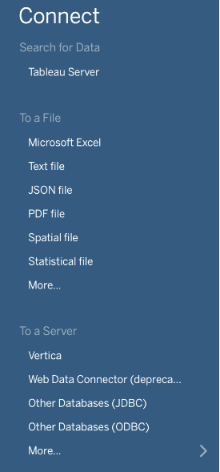
  *When you open a tableau application, these are the methods that you see to connect to the data.*
- 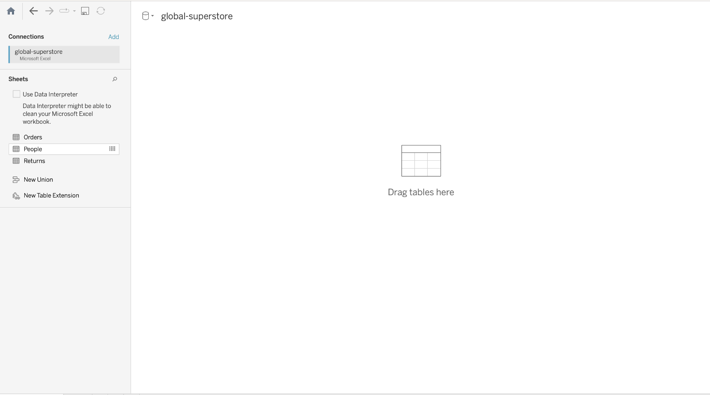*This is the first screen you see when you upload an excel sheet as a connection. If you drag the file from the left to your main screen it opens a window at the bottom with all the data. Similar to how you see your SQL data.*
- You can also use the data interpreter show on the left to clean the data. Refer [here](https://help.tableau.com/current/pro/desktop/en-us/data_interpreter.htm#what-does-data-interpreter-do) and [here](https://www.youtube.com/watch?v=Tt6lb1B1C6A)Data Interpreter can give you a head start when cleaning your data. It can detect things like titles, notes, footers, empty cells, and so on and bypass them to identify the actual fields and values in your data set. It can even detect additional tables and sub-tables so that you can work with a subset of your data independently of the other data. 
- 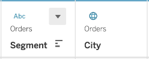 
  *This is what you first with the rows of data below. This is the column header for each row and hence is called the header row. Also if you notice it has decided the data type of each column. Also in this case you can see that Tableau automatically finds geospatial data. The three lines to the left are to sort the data. For numerical column there will be a `#` sign in 2 different colours. Blue is for discrete and green is for continuous. In case you think the data type is not correct press the down arrow to change it.*
- To rename column name just double click on the column name as seen in the above image.
- For string columns you can do string operations which are usually listed when you click the down arrow.
- 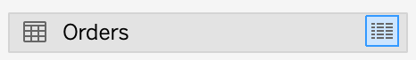 
  *If you press the blue box you can view the data temporarily without having to open it as an table explicity.*
- What is the difference between 'Split' and 'Custom Split' ? - 'Split' splits the column based on a guessed character while 'Custom Split' splits based on the user specified character.
- One of the major differences between Tableau Public and a paid Tableau account is that Tableau Public connects to far fewer data sources than a paid account.
- [To join tables](https://help.tableau.com/current/pro/desktop/en-us/datasource_relationships_learnmorepage.htm?source=productlink#WhereAreJoins)
	- Basically double click the table name and then joins will be available
	- Remember if you do it without double clicking then you will be making [relationships](https://help.tableau.com/current/pro/desktop/en-us/datasource_multitable_normalized.htm).
	- What you see in the tableau 'Data Source' is called a logical table, on double clicking you open the physical table.
	- Note: When you drag to the side you perform a join on the other hand if you drag below it you convert it to a union. If you drag _People_ below _Orders_, you get a union. Unions stack the data on top of each other, the second sheet ends up being appended to the end of the first sheet. This works great if you have multiple sheets with columns in common as the columns will match up. However if the columns are different, then you'll get a lot of "nulls" because columns are created for both sheets, but the first sheet doesn't have data for the second sheet's columns.
	- 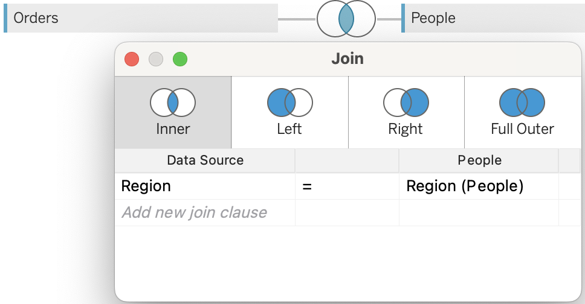
	  *When you drag the table to the right, it automatically selects the column on which to join and the join type. Also the default join type is inner join.*
- Tableau Relationships
	In Tableau, relationships allow you to connect multiple tables based on common fields without the need for manual joins. By establishing relationships, you can work with data from different tables as if they were a single consolidated dataset.
	
	Key points about relationships in Tableau:
	
	1. Purpose: Relationships simplify the analysis of data from multiple tables by automatically blending them together based on common fields.
	
	2. Cardinality: Cardinality defines the relationship between tables based on the number of matching records.
	   - One-to-One (1:1): Each record in one table matches with exactly one record in the other table.
	   - One-to-Many (1:N): Each record in one table can match with multiple records in the other table.
	   - Many-to-Many (N:N): Multiple records in one table can match with multiple records in the other table.
	
	3. Referential Integrity: Referential integrity maintains consistency and validity of related data. Referential Integrity means a row in one table will always have a matching row in the other table, as determined by the value of their shared fields. If the database contains no records for cars without license plates or license plates without cars, that relationship has referential integrity.
	   - Some records match - Some records match means there isn’t (or you don’t know if there is) referential integrity.The default setting is to not assume referential integrity (Some records match).
	   - All records match - All records match means there is referential integrity.
	- https://www.tableau.com/blog/relationships-tableau-data-model
	- https://help.tableau.com/current/pro/desktop/en-us/cardinality_and_ri.htm
- There are three main products that you can create using Tableau:
	1.  Worksheets
	2.  Dashboards  
	3.  Stories
- 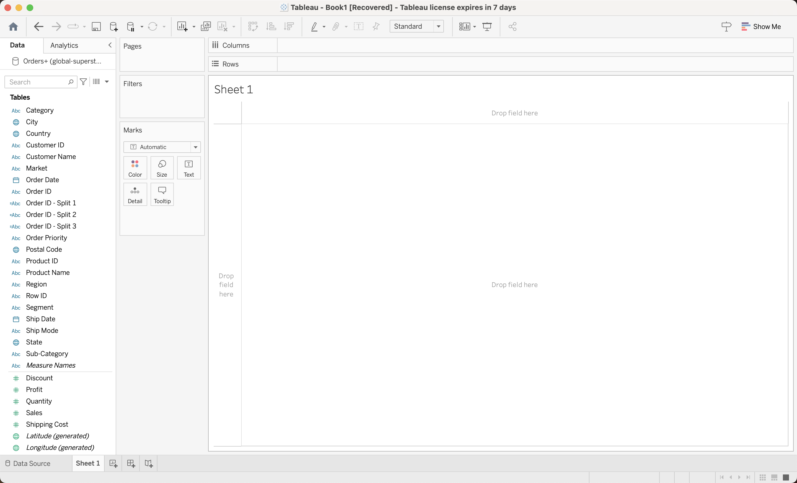
  *On the left you’ll see your data columns (also called "fields"), split between dimensions and measures. Categorical, qualitative, and time data are listed as dimensions. Quantitative numerical data is listed as measure. Tableau automatically detects the data type in each column and splits them up accordingly.
  You'll notice the dimensions are colored blue and the measures are green. Blue for discrete data and green for continuous data. Remember that discrete data can only be certain values like integers or categories, while continuous data can be any value.
  Dimensions aren't required to be discrete and measures aren't required to be continuous. You can convert discrete data to continuous in some cases, such as with time. Right click the field, or click the little triangle to bring up the menu. You can’t do this with categorical data because it can’t be continuous. You can also convert continuous data to discrete.
  Tableau automatically aggregates measures, but not dimensions. That is, it does calculations like sums and means. Dimensions are used to group the data and set the level of granularity.*
  - Plotting Data - You can select the data you want to plot by dragging the fields to the columns or rows shelves. When you drag a discrete field to Columns, it creates a discrete axis. When you use a continuous field, it creates a continuous axis. You can also drag the fields directly onto the sheet.
  - Creating Calculated Field
	  - In the data tab right next to search pane, select the down arrow and in that select 'Create Calculated Field'
	  - 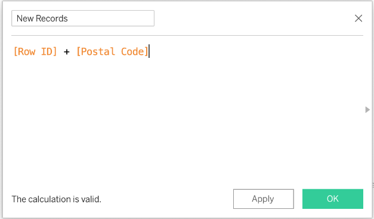
	    *A box similar to this opens. In this box enter the name of the field at the top. And enter the calculation next.*
	  - The new field will be added to the measures section, `=#` indicates that is a calculated field.
  - Dimensions vs Measure
	  - Dimension - Categorical Data Type
	  - Measure - Quantitative Data Type
  - Double clicking any label in the left **Data** Tab moves them to the **Marks** Section.
  - 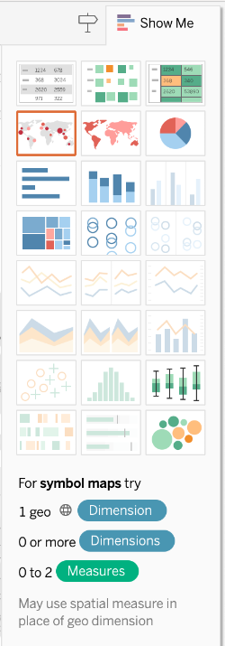
    *The `Show Me` panel on the right shows all the possible charts given the data. When starting fresh, it is best to first select the necessary columns and then click on Show Me which will give the possible and best visualization.*
  - 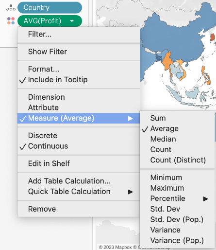
    *Clicking on the down arrow in a sheel you can see various measure options and dealing with the shell data.*
 -    To save to tableau public - For **Tableau Desktop** (only if you have a Tableau License Key), in order to save your work to Tableau Public select **Server > Tableau Public > Save to Tableau Public**. Then you will need to create an account, and name the workbook. After saving, your visual should appear in your browser. (To open from tableau public follow the same method.)
 - **Note**: Solution for some common issues with saving files -
	 - The most common issue is fixed by logging out from your profile clicking on your name at the bottom bar, but without exiting tableau. After that click save, login once again, and it should work.
	 - If you are still getting an error, go to data source tab, click the update button and then save.
 - Aggregation
	 - The default is SUM.
	 - 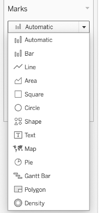
	   *The default in marks is automatic. Based on this setting the plots are updated based on data selected by us.*
	 - Whenever you add numerical vaues to Tableau Sheets it automatically aggregates them to either SUM or COUNT. To make them not aggregate it and use values individually you can try to change it to dimension.
 - Marks Section in Tableau
   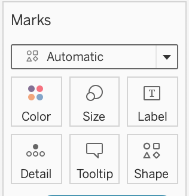
	 - Mark Type: This option allows you to select the type of mark or visual element to represent your data, such as bars, lines, circles, squares, or maps.
	 - Size: You can adjust the size or thickness of the marks in the visualization, allowing you to emphasize certain data points or highlight differences in magnitude.
	 - Color: The color option enables you to assign different colors to the marks based on specific data values or categories, aiding in visually differentiating data points and encoding additional information.
	 - Shape: The shape option allows you to assign different shapes to the marks based on specific data values or categories, providing a way to differentiate data points using distinct shapes.
	 - Label: You can display labels on the marks to provide additional information, such as values or names. Labels can be customized to show different fields or calculations associated with the marks.
	 - Tooltip: The tooltip option allows you to define the information that appears when you hover over individual marks in the visualization. You can choose specific data fields or calculations to display as tooltips, providing additional context to the viewer.
	 - Detail: Adding a field to the "Detail" shelf allows you to display more detailed information for each mark, providing a higher level of granularity in the visualization. Fields added to the "Detail" shelf become available for inclusion in the tooltip. This allows you to provide additional context or information when hovering over individual marks in the visualization.
 - Hierarchies in Tableau - 
	 - Tableau automatically creates hierarchies for time and date based data.
	 - 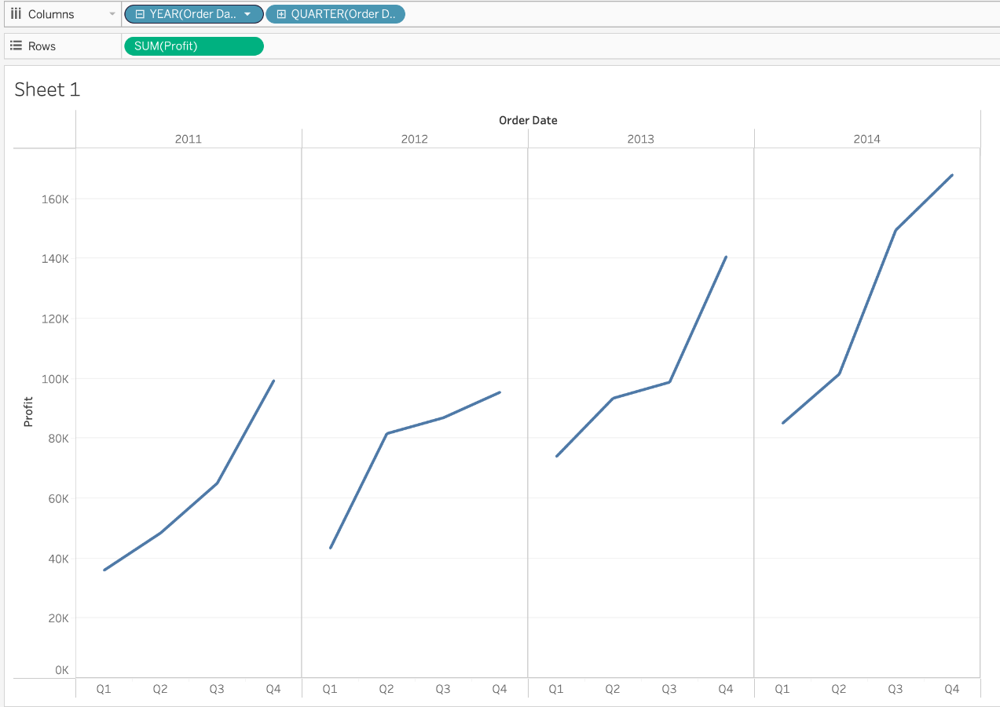
	   *Here use the `+/-` sign to drill up and down the hierarchies based on time/date.*
	- To further change the level of hierarchies you can also drag the pills out of the `Columns` section here. This will give you only for eg a quarter wise view without the division on years.
	- Although there is one issue with above step. When we remove years, the value for each quarter will be the sum of values over multiple years. To make it continuous go to the name of the column in the `Data` tab and change it to continuous values. This way it will give the same data over the quarters over multiple years.
	  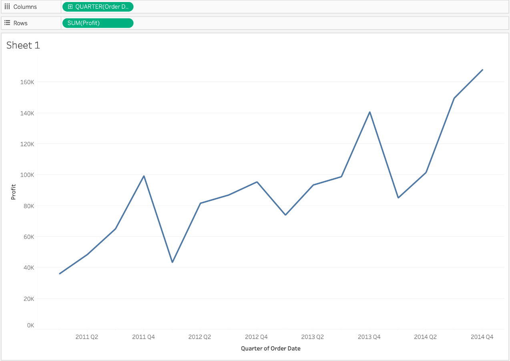*If you look at the plot the values are now over years for quarters since the data is continuous*
	- To manually create hierarchies
	  1. First select the column which is the sub-category
	  2. Drag it to the column which is supposed to be the main category
	  3. Rename the category based on what you want its name to be and then drag it to either `Rows` or `Columns`
 - Filters
	 - 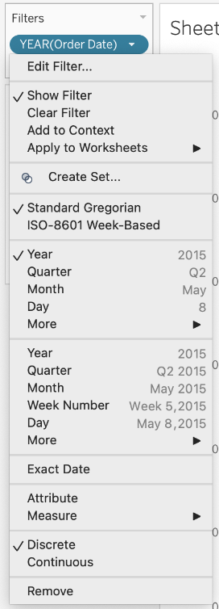
	   *Once you add a filter in the `Filters` Section. You can right click on the pill to see the options.*
	 - 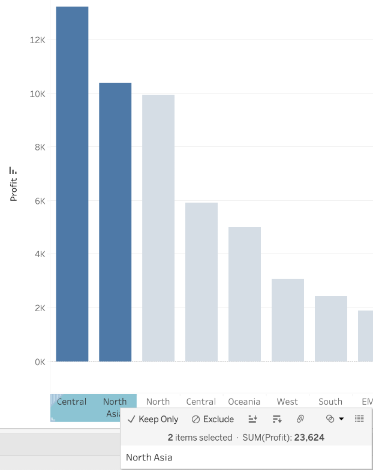
	   *To create filters from the visible data just select the necessary labels and select `Keep Only` or `Exclude`.*
	   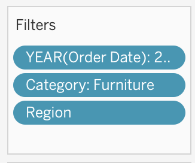
	   *As soon as we do that a pill corresponding to the column is added in the filters section. In this case the pill is `Region`*
	 - 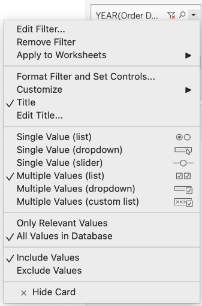
	   *Once you do show filters, you can click the filter controls to change the way you view filters.*
 - To change the color palette first add all the data as visualization then you get the option to change palette when you press the color.
 - Small Multiples - Small multiples, also known as trellis charts or panel charts, are a visualization technique in Tableau where multiple charts, each representing a subset of the data, are displayed together in a grid-like layout. This technique helps in comparing patterns and trends across different segments or categories. Small multiples are particularly effective when you have a large number of categories or want to analyze data from multiple dimensions simultaneously. They provide a compact and structured way to explore patterns and relationships within the data.
 - Dual Axis
	 - Basically when we want just one plot to show two different measures using two different axis but the same sheet.
	 - 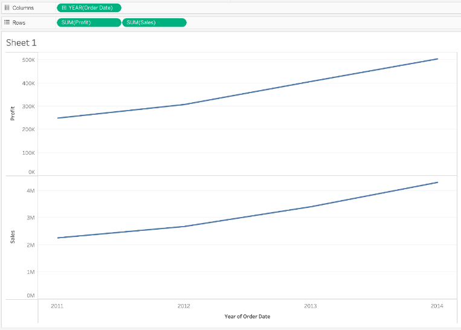*If you wanted to plot both Sales and Profit on the same sheet this is what you would get.*
		   To make a dual axis plot from this. Just select any one of the pills in the `Rows` section and select option `Dual Axis`. You get the following plot.
		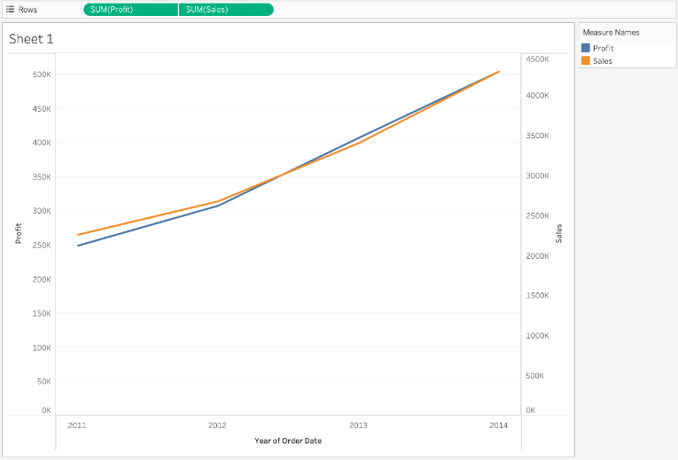
	 - 
 - Groups
	 In Tableau, groups allow you to combine related data points or categories into a single entity. Grouping is a useful feature when you want to analyze and visualize data at a higher level of aggregation or create custom segments for analysis.	
	1. Select the data points or categories that you want to group. This can be done by clicking and dragging to select multiple items in a field or by using Ctrl/Cmd + Click to select individual items.
	
	2. Right-click on the selected data points and choose "Group" from the context menu.
	
	3. Tableau will create a new group, and you can provide a name for the group. The selected data points will be grouped together under this name.
	
	4. You can continue to add more data points to the group by repeating the selection and grouping process.
	
	5. To ungroup a group, right-click on the group name in the data pane and choose "Ungroup".
	
	Once you have created a group, Tableau treats it as a single entity for analysis and visualization purposes. You can use the group like any other field in Tableau, including dragging it onto the rows or columns shelf, using it in calculations, applying filters, or creating visualizations.
 - If you want to have multiple groups then make the first group and then change alias of each of the mini group under the main group tag on the right.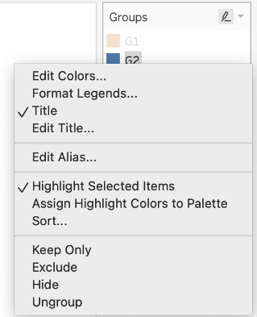
   *Once you create group you can see this option on the right. The main `Groups` tag is what you see on the left and is user defined.*	
 - Sets
	 - To create set right click on a particular dimension and then select create set. Then select the conditions for set. For e.g.
	   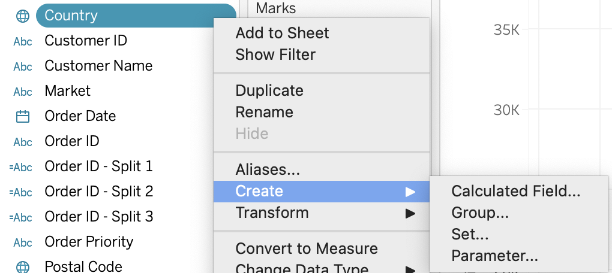
	   *Here we selet the dimension on which we want to make a set.*
	   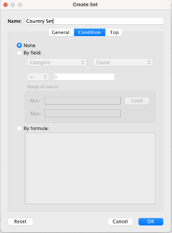
	   *Here we set the condition. You can also select either based on `Top 10` or something similar or outright general cases.*
 - The main difference between groups and sets is that sets are dynamic since they are usually based on conditions so we select all the data points that satisfy the condition.
 - Aggregation in Calculated Fields
	 - We can use mathematical functions in Calculated fields to aggregate values before using the pills to further do calculations.
	 - You can also use IF,THEN and ELSE while making new calculated fields to aggregate based on conditions. E.g
		 - `IIF(condition, if true, if false)`
		 - `IF condition THEN "Good" ELSE "Bad"`
 - Common String Comparisons while creating calculated fields		
	1. Equal to: To check if two strings are equal, you can use the equal operator (`=`). For example, `IF [Field1] = 'Value' THEN ... END` will evaluate as true if `[Field1]` is equal to the string 'Value'.
	
	2. Not equal to: To check if two strings are not equal, you can use the not equal operator (`<>`). For example, `IF [Field1] <> 'Value' THEN ... END` will evaluate as true if `[Field1]` is not equal to the string 'Value'.
	
	3. Contains: To check if one string contains another, you can use the `CONTAINS()` function. For example, `IF CONTAINS([Field1], 'Substr') THEN ... END` will evaluate as true if `[Field1]` contains the substring 'Substr'.
	
	4. Starts with/Ends with: You can use the `STARTSWITH()` and `ENDSWITH()` functions to check if a string starts with or ends with a specific substring. For example, `IF STARTSWITH([Field1], 'Prefix') THEN ... END` will evaluate as true if `[Field1]` starts with the string 'Prefix'.
	
	5. Case sensitivity: By default, string comparisons in Tableau are case-insensitive. If you want to perform case-sensitive comparisons, you can use the `LOWER()` or `UPPER()` functions to convert the strings to lowercase or uppercase before comparing them.
	
	6. Sorting: Tableau automatically sorts string values in ascending order by default. If you need to perform custom sorting based on specific criteria, you can create a calculated field that assigns numerical or alphabetical values to each string and use that field for sorting.
	
 - Table Calculations
	 - Table calculations in Tableau are used to perform calculations on a specific subset of data within a table or visualization. They allow you to analyze data within the context of dimensions and measures present in your view. Table calculations can perform aggregations, calculations across rows or columns, and comparisons within specific partitions of data.
	 - 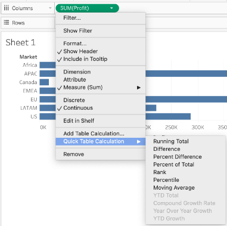
	   *Select the measure pill and then seleect the calculation*
	   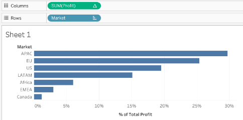
	   *This is after selecting percentage of total.*
 - Stories
	   Stories in Tableau are a feature that allows you to combine multiple visualizations, dashboards, and sheets into a cohesive narrative or presentation. With stories, you can guide your audience through a sequence of interactive and engaging data visualizations, helping them understand the insights and analysis you want to convey. Steps:
	
	1. Creating a Story: To create a story in Tableau, go to the "Worksheet" menu and select "New Story" or click on the "New Story" tab at the bottom of the Tableau window. This opens the Story pane where you can start building your story.
	
	2. Adding Content: In the Story pane, you can add various components to your story, including worksheets, dashboards, text, images, and web pages. You can drag and drop these elements onto the canvas and arrange them in the desired order.
	
	3. Story Points: Each piece of content in your story is represented as a story point. Story points capture a specific view of a worksheet, dashboard, or other content. You can add story points by clicking on the "+" button in the Story pane or by right-clicking on a worksheet or dashboard and selecting "Add to Story". You can then customize each story point by adjusting the view, applying filters, or highlighting specific data.
	
	4. Story Navigation: Within a story, you can control the navigation flow by specifying how the user interacts with the content. You can set actions such as clicking on a worksheet or a button to advance to the next story point, or use filters to dynamically change the displayed data.
	
	5. Annotations and Captions: To provide additional context or explanations, you can add annotations and captions to your story points. Annotations allow you to highlight specific data points or areas of interest, while captions provide text descriptions to guide your audience.
	
	6. Formatting and Design: Tableau provides various formatting options to enhance the visual appeal of your story. You can adjust the layout, fonts, colors, and background to create a cohesive and visually appealing presentation.
	
	7. Presenting the Story: Once your story is complete, you can enter the presentation mode to deliver it to your audience. In this mode, you can navigate through the story points, interact with the visualizations, and engage in data-driven discussions.

 - Dashboards
	   Dashboards in Tableau are a powerful feature that allows you to combine multiple visualizations, worksheets, and interactive elements into a single, consolidated view. Dashboards provide an overview of key information and insights, enabling users to analyze and explore data in a more focused and interactive way.  Steps:
	
	1. Creating a Dashboard: To create a dashboard in Tableau, go to the "Dashboard" menu and select "New Dashboard" or click on the "New Dashboard" tab at the bottom of the Tableau window. This opens the Dashboard pane where you can start building your dashboard.
	
	2. Adding Worksheets: In the Dashboard pane, you can add worksheets to your dashboard by dragging and dropping them from the Sheets pane onto the canvas. You can also add other components like images, text, filters, and legends to enhance the dashboard's functionality.
	
	3. Arranging and Sizing: Once you have added worksheets and components to your dashboard, you can arrange them on the canvas to create a visually appealing layout. Tableau provides a grid-based layout system that allows you to snap components into place and resize them as needed. You can also use containers and layout containers to organize your dashboard elements.
	
	4. Interactivity and Actions: Tableau dashboards are highly interactive. You can add actions to enable users to interact with the visualizations. Actions can be defined to filter data, highlight specific elements, navigate to other sheets or dashboards, and more. This allows users to explore the data and gain deeper insights.
	
	5. Formatting and Styling: Tableau offers a range of formatting options to customize the appearance of your dashboard. You can apply color schemes, fonts, borders, and backgrounds to create a consistent and visually appealing design. You can also use formatting techniques like tooltips, legends, and annotations to provide additional context and information.
	
	6. Device Layouts: Tableau allows you to create responsive dashboards that adapt to different devices and screen sizes. You can design specific layouts for desktops, tablets, and mobile devices to ensure an optimal viewing experience across different platforms.
	
	7. Publishing and Sharing: Once your dashboard is complete, you can publish it to Tableau Server or Tableau Public for sharing with others. You can control access permissions and allow users to interact with the dashboard online or embed it in webpages or presentations.

 - To load CSVs choose text file in connect options.
 - Practice
	 - [Dashboard and Stories](https://learn.udacity.com/courses/ud1006/lessons/a763f8b7-3635-4291-991c-c2c643425a2b/concepts/a244abe1-55d6-472a-86a8-ace3b616eefc)
	 - 
 - Example Videos
	 - 